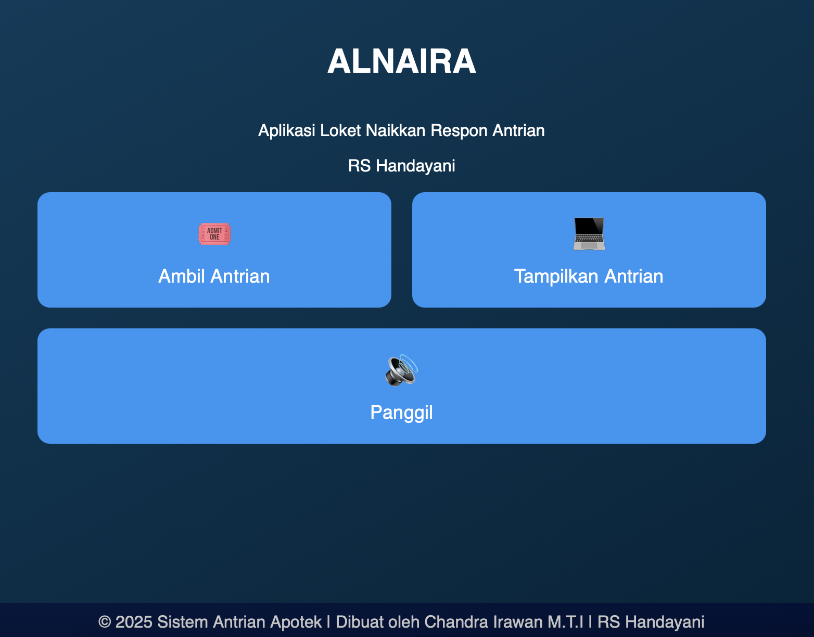
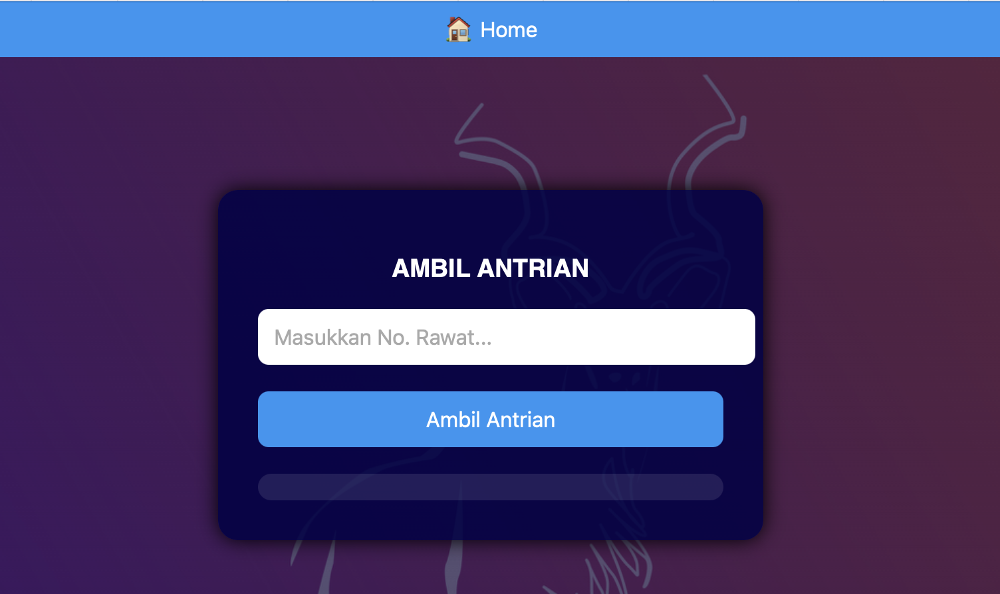
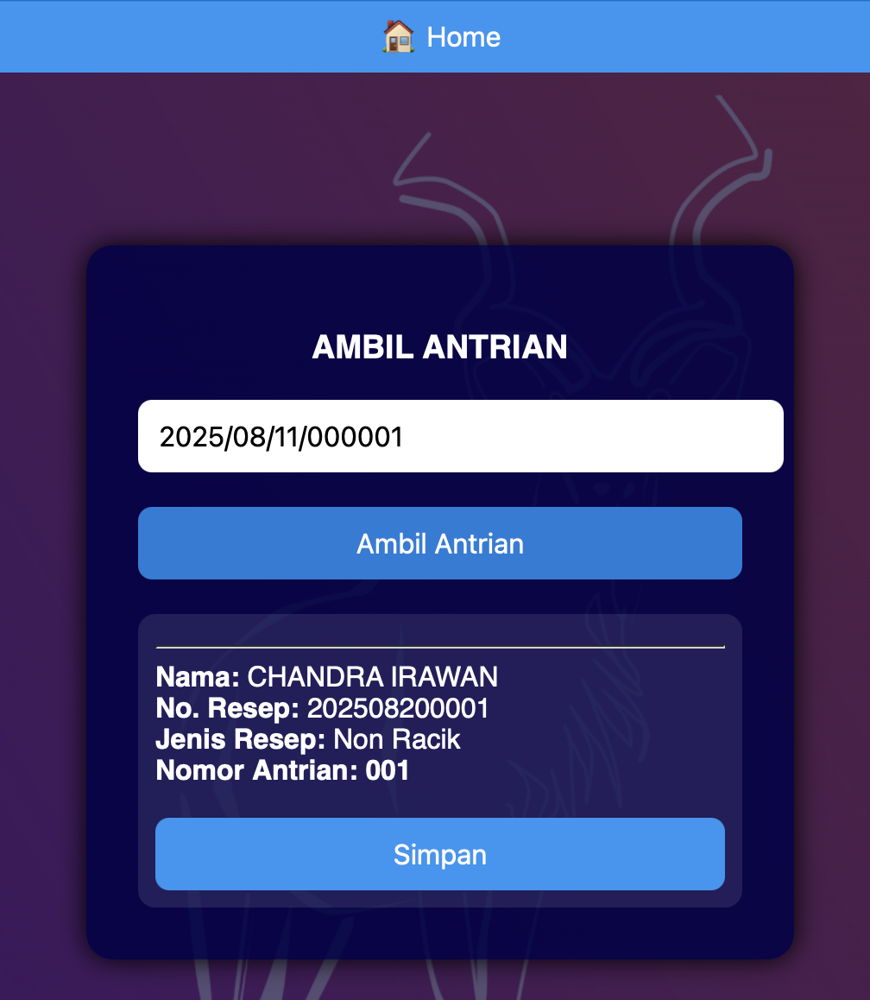
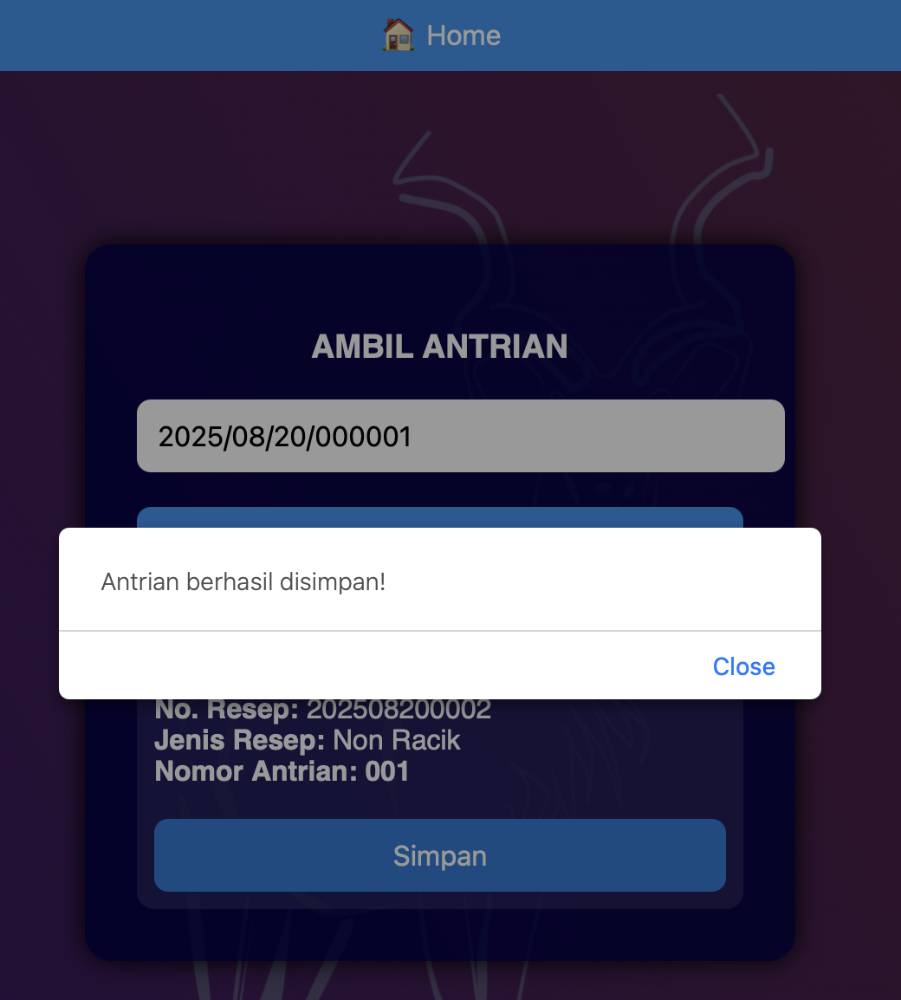
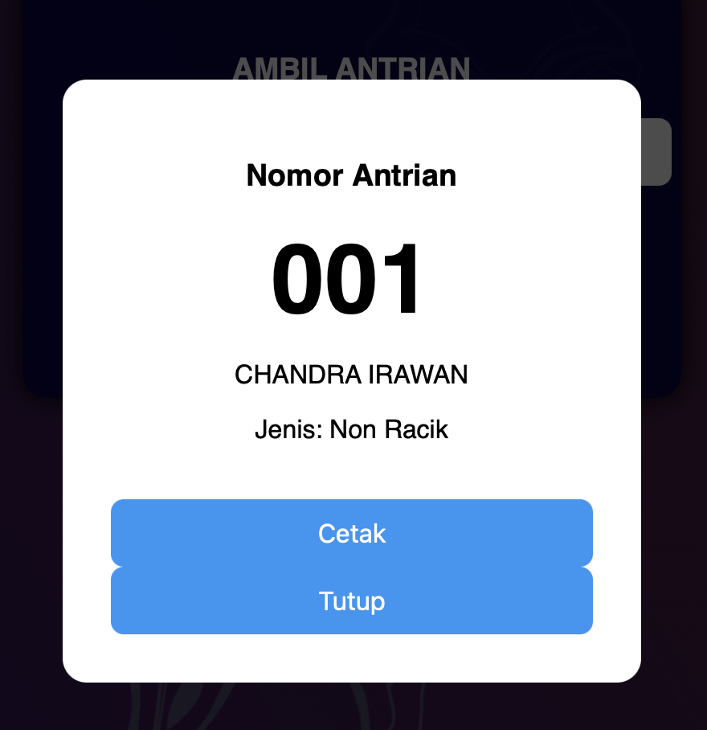
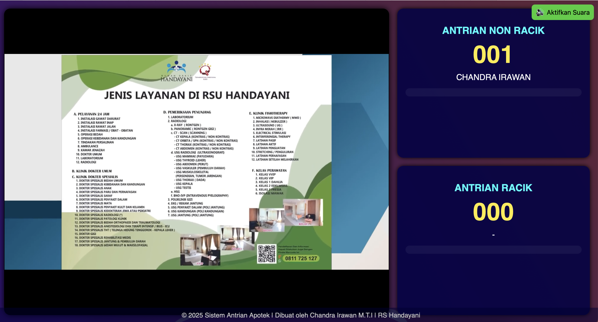
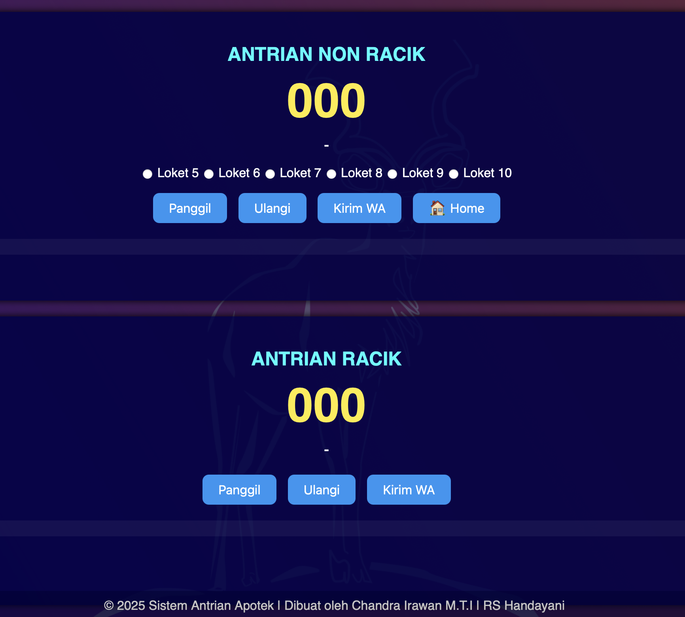

# 📌 Antrian Farmasi Rajal (Open Source)

**Pembuat:** Chandra Irawan, M.T.I  

Aplikasi ini bersifat **open source** dan **tidak untuk diperjualbelikan**.  
Siapa pun diperbolehkan menggunakan, mengembangkan, menambahkan, atau memodifikasi sesuai kebutuhan.  

## ☕ Donasi
Dukung pengembangan aplikasi ini melalui Saweria:  

| Scan QR Code | Klik Link |
|--------------|-----------|
|  | [👉 Saweria.co](https://saweria.co/KumbangKobum) | 
**BCA 8110400102 A/N Chandra Irawan** ☕🙏  

Aplikasi ini dikembangkan berdasarkan **logika aplikasi Delphi** yang sebelumnya dibuat oleh **Emirza Wira, M.T.I** dalam bentuk file `.exe`.

---

## ⚙️ Cara Penggunaan

1. Pastikan menggunakan **PHP 7.4 atau yang lebih baru**  
2. Gunakan **MySQL** atau **MariaDB** sebagai database  
3. Import file `antrian_farmasi_rajal.sql` ke dalam database **SIMRS Khanza**  
4. Pastikan folder/file realtime audio bisa ditulis web server:

```bash
chmod 777 panggil
chmod 666 panggil/last_audio.json panggil/last_antrian.json panggil/skipped_antrian.json
```

### Jika DB sudah terlanjur berjalan (migrasi dari skema lama)
Jalankan SQL berikut agar mendukung 1 `no_rawat` bisa punya banyak `no_resep`:

```sql
ALTER TABLE antrian_farmasi_rajal
  DROP PRIMARY KEY,
  ADD COLUMN id BIGINT UNSIGNED NOT NULL AUTO_INCREMENT PRIMARY KEY FIRST;

ALTER TABLE antrian_farmasi_rajal
  ADD UNIQUE KEY uq_tgl_no_resep (tgl_antri, no_resep),
  ADD UNIQUE KEY uq_tgl_resep_no_antrian (tgl_antri, resep, no_antrian),
  ADD KEY idx_status_resep_tgl_no (status, resep, tgl_antri, no_antrian);
```

Jika ada error duplicate saat menambah unique key, cek data duplikat dulu:

```sql
SELECT tgl_antri, no_resep, COUNT(*) jml
FROM antrian_farmasi_rajal
GROUP BY tgl_antri, no_resep
HAVING COUNT(*) > 1;
```

---

## 📂 Halaman/Portal Utama
Berikut Halaman Utama Aplikasi Antrian

Digunakan untuk memilih menu **ambil antrian**,**tampilkan antrian** merupakan dashboard untuk penggungjung, dan **panggil** digunakan untuk memangil antrian berdasarkan nomor urut resep.
#### 1. Ambil Antrian
- Input menggunakan **`no_rawat`** setelah dokter melakukan input resep.  
- Untuk mempermudah, gunakan **QR Code Scanner**.  
- Buat QR Code pada **SEP** yang berisi nomor rawat.  
- Ketika pasien ke loket farmasi, petugas cukup melakukan **scan** untuk mengambil antrian.  
- Antrian otomatis dipisahkan menjadi **Racik** dan **Non Racik**.  
- Tersedia tombol cepat **Ambil + Simpan + Cetak** untuk memproses satu klik.
Berikut tampilan halaman ambil antrian, dimana akan otomatis menyaring obat racikan dan obat nonracikan lalu langsung menerbitakan nomor antrian obatnya :




---


### 2. **Tampil Antrian**
- Menampilkan urutan **antrian racikan** dan **non racikan**.  
- Terdapat **slot video edukasi** yang bisa digunakan untuk menampilkan video informatif/edukasi.  


---

### 3. **Panggil Pasien**
- Digunakan untuk **memanggil pasien** ketika obat siap diserahkan.  
- Setiap loket yang memanggil pasien akan otomatis update data ke tampilan display.  
- Sistem akan melakukan update nomor antrian.  
- Cukup menggunakan **1 TV display atau lebih** untuk memanggil/mengeluarkan suara antrian.
- **Suara hanya diputar di halaman display** (`/panggil/`), bukan di halaman tombol panggil (`/panggil/tombol_panggil.php`).
- Tombol **Lewati** akan memasukkan **nomor yang sedang dipanggil** ke daftar terlewati (kasus pasien no-show).
- Tombol **Panggil Terlewati** akan memanggil kembali antrean yang dilewati (urutan FIFO).
- Pada menu panggil, tersedia panel **Daftar Terlewati** agar petugas bisa memantau nomor yang belum hadir.
- Jika pasien terlewat bisa dikirimkan pesan bahwa obat sudah siap diambil menggunakan **WAHA**.
- Jika terdapat loket lebih dari satu, setiap admin loket dapat memilih loket mana yang digunakan untuk memanggil pasien.


---

### 4. **Laporan Harian**
- Menampilkan ringkasan operasional harian dari audit log internal.
- Ringkasan meliputi jumlah ambil antrian, panggil, ulangi, error validasi, distribusi jam, dan statistik per loket.
- Akses melalui menu **Laporan Harian** di portal utama.
- Tabel `antrian_farmasi_rajal` dibersihkan otomatis oleh aplikasi dengan retensi **14 hari**.

---

## 📜 Catatan
- Aplikasi ini **bebas digunakan** untuk keperluan pengembangan SIMRS.  
- **Tidak diperbolehkan untuk diperjualbelikan.**  
- Konsep open source ini bertujuan membantu pengembangan layanan kesehatan, khususnya di farmasi rawat jalan.  

### Troubleshooting Suara Display
- Pastikan membuka halaman display di: `http://localhost/antrian_apotek/panggil/`
- Klik tombol **Aktifkan Suara** sekali di halaman display.
- Lakukan hard refresh bila perlu (`Cmd+Shift+R` / `Ctrl+F5`).
- Cek update event audio:
  - `http://localhost/antrian_apotek/panggil/get_last_audio.php`
  - file `panggil/last_audio.json` harus berubah saat klik **Panggil/Ulangi/Panggil Terlewati**.

---

✨ Selamat menggunakan & semoga bermanfaat ✨
