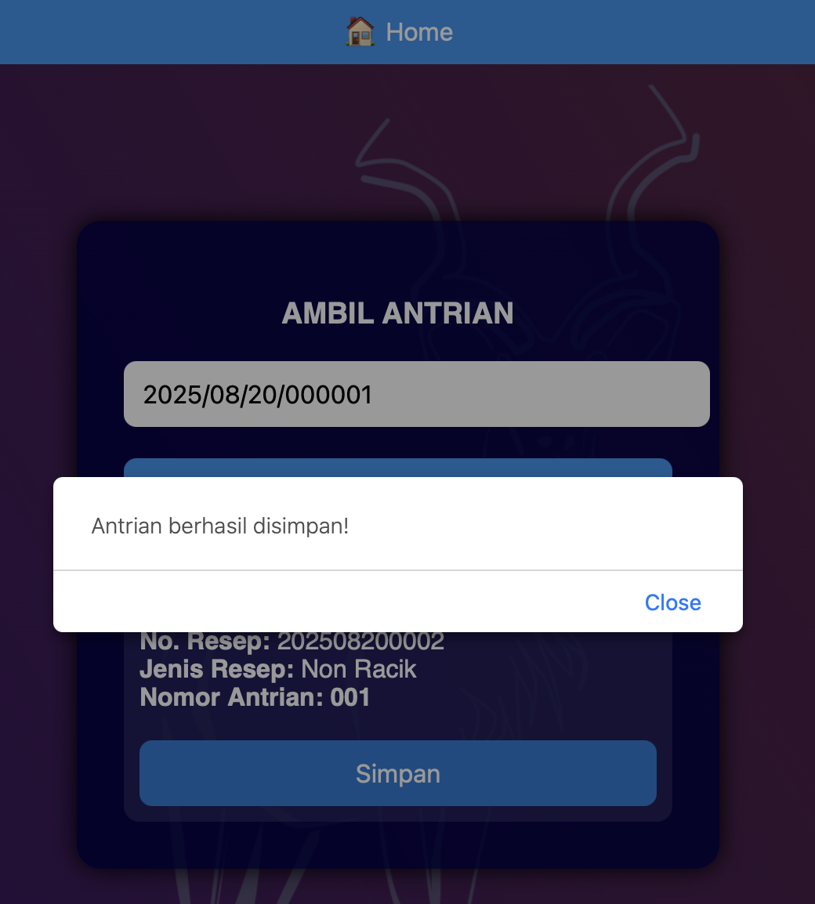

# 📌 Antrian Farmasi Rajal (Open Source)

**Pembuat:** Chandra Irawan, M.T.I  

Aplikasi ini bersifat **open source** dan **tidak untuk diperjualbelikan**.  
Siapa pun diperbolehkan menggunakan, mengembangkan, menambahkan, atau memodifikasi sesuai kebutuhan.  

## ☕ Donasi
Dukung pengembangan aplikasi ini melalui Saweria:  

| Scan QR Code | Klik Link |
|--------------|-----------|
|  | [👉 Saweria.co](https://saweria.co/KumbangKobum) | 
**BCA 8110400102 A/N Chandra Irawan** ☕🙏 

Aplikasi ini dikembangkan berdasarkan **logika aplikasi Delphi** yang sebelumnya dibuat oleh **Emirza Wira, M.T.I** dalam bentuk file `.exe`.

---

## ⚙️ Cara Penggunaan

1. Pastikan menggunakan **PHP 7.4 atau yang lebih baru**  
2. Gunakan **MySQL** atau **MariaDB** sebagai database  
3. Import file `antrian_farmasi_rajal.sql` ke dalam database **SIMRS Khanza**  

---

## 📂 Halaman/Portal Utama
Berikut Halaman Utama Aplikasi Antrian

Digunakan untuk memilih menu **ambil antrian**,**tampilkan antrian** merupakan dashboard untuk penggungjung, dan **panggil** digunakan untuk memangil antrian berdasarkan nomor urut resep.
#### 1. Ambil Antrian
- Input menggunakan **`no_rawat`** setelah dokter melakukan input resep.  
- Untuk mempermudah, gunakan **QR Code Scanner**.  
- Buat QR Code pada **SEP** yang berisi nomor rawat.  
- Ketika pasien ke loket farmasi, petugas cukup melakukan **scan** untuk mengambil antrian.  
- Antrian otomatis dipisahkan menjadi **Racik** dan **Non Racik**.  
Berikut tampilan halaman ambil antrian, dimana akan otomatis menyaring obat racikan dan obat nonracikan lalu langsung menerbitakan nomor antrian obatnya :

---

### 2. **Tampil Antrian**
- Menampilkan urutan **antrian racikan** dan **non racikan**.  
- Terdapat **slot video edukasi** yang bisa digunakan untuk menampilkan video informatif/edukasi.  

---

### 3. **Panggil Pasien**
- Digunakan untuk **memanggil pasien** ketika obat siap diserahkan.  
- Setiap loket yang memanggil pasien akan otomatis redirect ke tampilan display.  
- Sistem akan melakukan update nomor antrian.  
- Cukup menggunakan **1 TV display atau lebih** untuk memanggil/mengeluarkan suara antrian.
- jika pasien terlewat bisa dikirimkan pesan untuk memberikan informasi bahwa obat sudah bisa diambil di loket antrian menggunakan **WAHA**
-jika terdapat loket lebih dari satu setiap admin loket dapat memilih loket mana yang digunakan untuk memanggil pasien,

---

## 📜 Catatan
- Aplikasi ini **bebas digunakan** untuk keperluan pengembangan SIMRS.  
- **Tidak diperbolehkan untuk diperjualbelikan.**  
- Konsep open source ini bertujuan membantu pengembangan layanan kesehatan, khususnya di farmasi rawat jalan.  

---

✨ Selamat menggunakan & semoga bermanfaat ✨